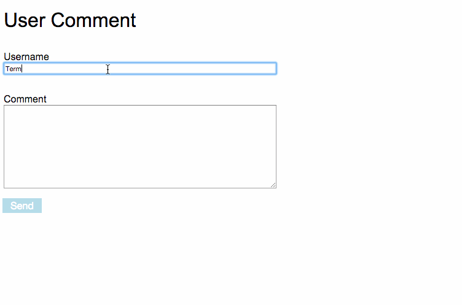

# Frontend Pairing Test

This is a simple pairing test to test a candidates Html, CSS, JavaScript and general frontend skills. The approach to this
test should be one of speaking with the candidate as they go, discussing them on their approach and getting a feel for
how the candidate thinks and works around a task.
It is not expected that the user will finish this task in the time given and when this is the case it is worth asking
them how they would approach the tasks they have not got to.

The candidate can use what they are comfortable with. JavaScript or jQuery and use CSS.

## Example

## Tasks

1. We would like you to create an accessible user comment form, consisting of a name and a comment section to send to a backend.
2. We would like you to style the form to look functional. Up to the interviewee's discretion.
3. Using responsive web design techniques,
 - Make the inputs and button full width at mobile width (600px).
 - Decrease the font size at mobile width.
 - Make the submit button easily pressed in "mobile" view.
 
4. On submit, display the comment above the form using Javascript, and stay on the page, with the inputs cleared, so multiple comments can be added in this way.
   If there is time, add client-side validation to prevent submission if any field is empty; or ask the interviewee how they would approach this.

## Expect to see

1. Html, accessibility, form creation and sending to the server.
    - A form with a legend, fieldset, labels. 
    - Labels named with the `for` attribute.
    - `name` attributes for the inputs and submit.
    - An understanding of where this form is going, `action` and `method` attributes.
    
2. CSS knowledge.
    - A demonstration of the understanding of CSS.
    - Separation of concerns by placing the CSS in a separate file.
    
3. Responsive design knowledge
    - An understanding of mobile first.
    - An understanding of `small`, `medium` and `large` device sizes.
    - An understanding of responsive design.
    
4. JavaScript knowledge
    - Separation of concerns by placing the JavaScript in a separate file. 
    - Demonstration of namespacing JavaScript.
    - Knowledge of `events`.
    - Understanding of selecting elements in a page.